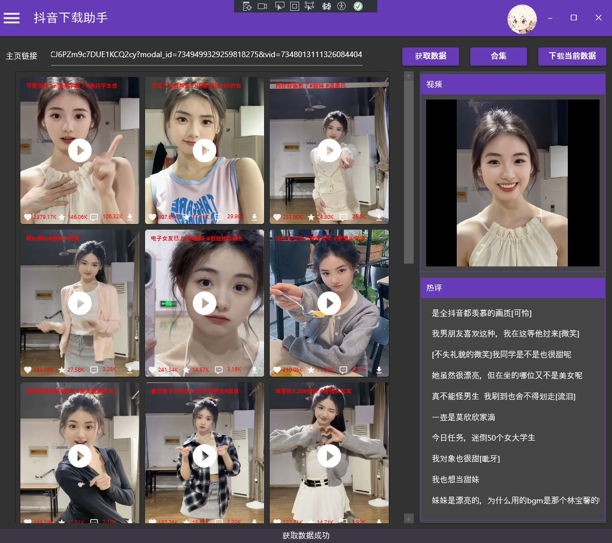
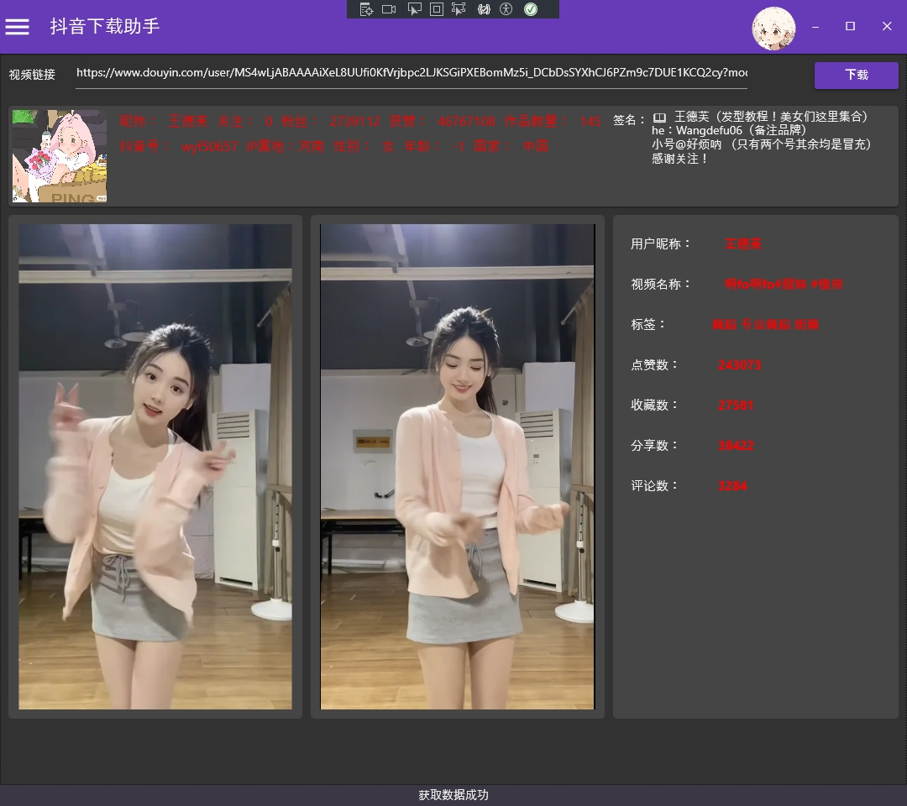

# DouYin.DownLoader
学习WPF的一个练手项目目前实现了单个抖音视频、图集下载和主页视频、图集下载，下载文件保存在本地。

## 使用方法
1. 下载源码
2. 打开DouYin.DownLoader.sln
3. F5运行
## 涉及Nuget Packges
1. WPF Material Design UI
2. CommunityToolkit.Mvvm   
3. Jint 运行js脚本
## 界面展示
主页视频下界面

单个作品下载界面

导航界面

